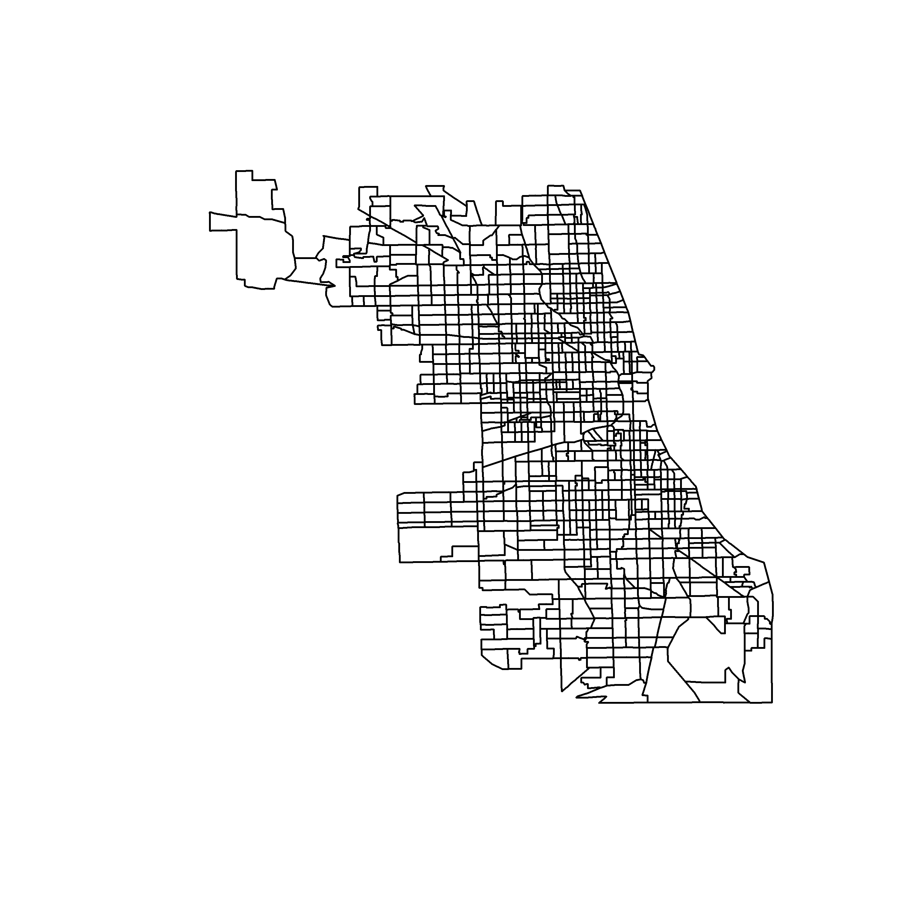
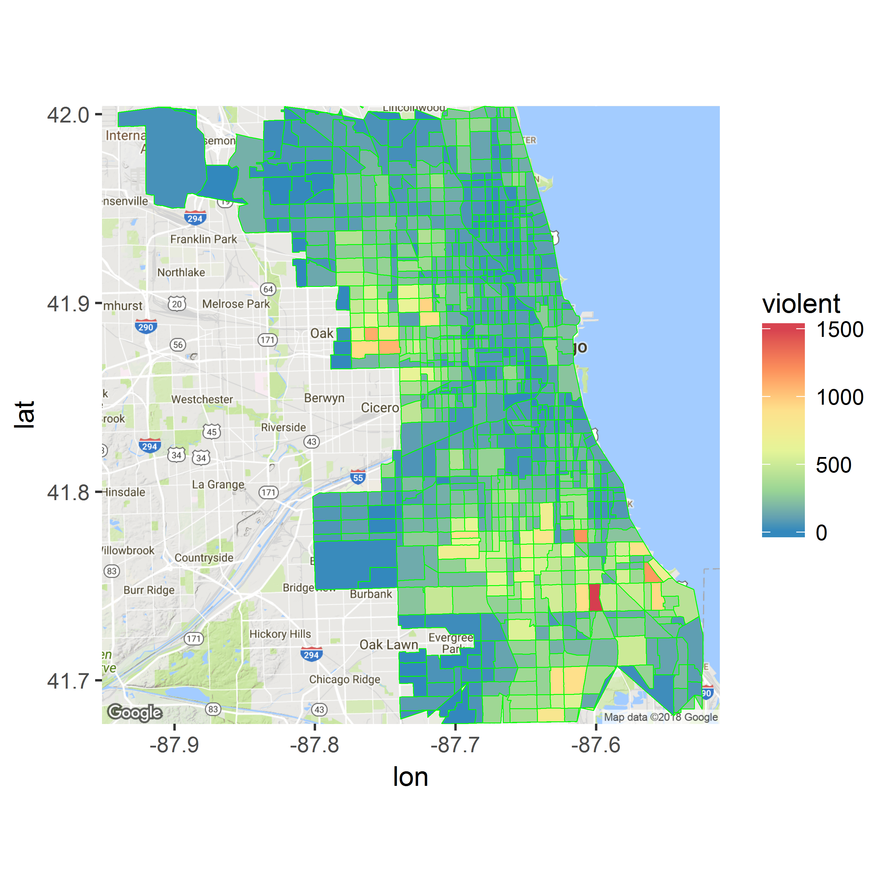
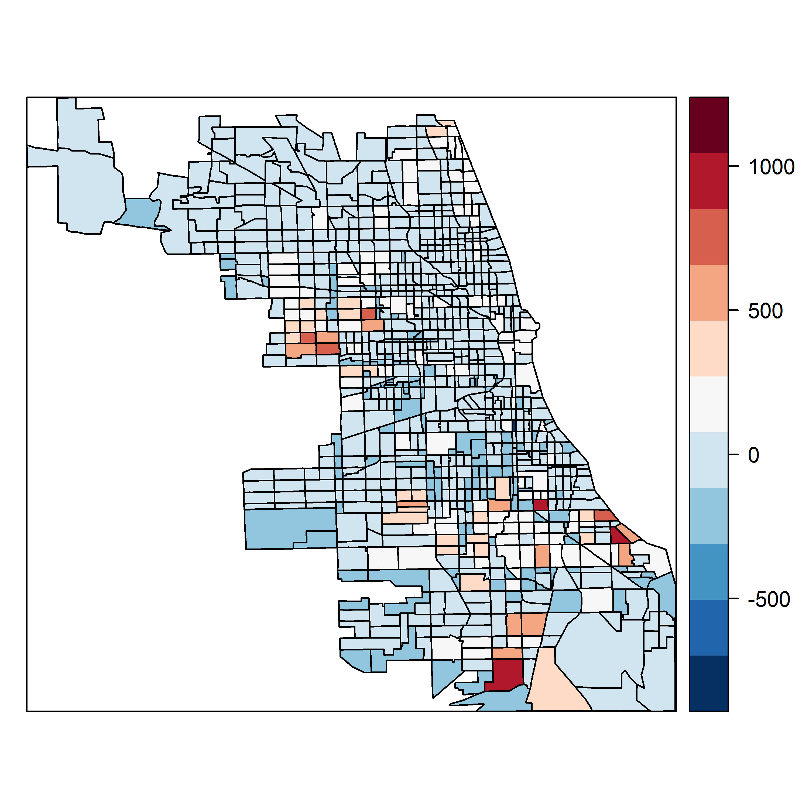
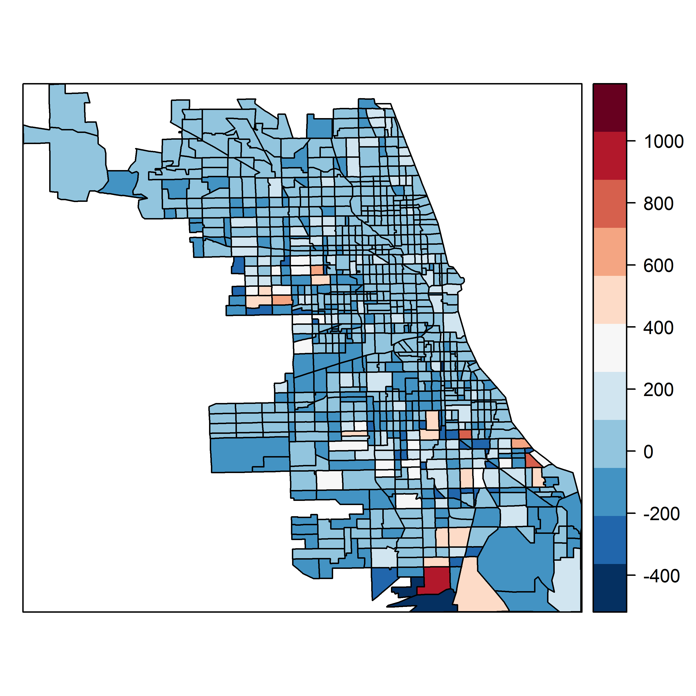

## Resumo {-}

*Os modelos estatísticos espaciais, notadamente os modelos de regressão espacial e geoestatísticos, vem sendo progressivamente cada vez mais utilizados nas avaliações de imóveis. O uso de modelos de regressão linear com dados espaciais são sempre suspeitos: a possibilidade de autocorrelação espacial dos resíduos é grande, ainda mais na área de avaliação de imóveis urbanos, onde a variável localização é sabidamente importante na imensa maioria dos centros urbanos. Atualmente, como meio de contornar este problema, a maioria dos avaliadores adota a criação de variáveis de distância a polos de valorização, mas isto requer um conhecimento detalhado do local por parte do avaliador e nem sempre estas variáveis podem ser definidas precisamente, ou ainda, enquanto captam a influência da proximidade de um determinado polo, deixam escapar a influência de outros fatores de valorização. No entanto, na regressão espacial, há a dificuldade computacional (necessidade de softwares específicos, treinamento, etc.). Pretende-se demonstrar neste artigo como os avaliadores podem fazer uso da poderosa linguagem **R** para a utilização da regressão espacial, com uma curva de aprendizado suave.*

**_Palavras-chave_**: *Regressão Espacial. Avaliação de imóveis. Inferência*

#INTRODUÇÃO

Segundo @trivelloni07, 

> os modelos tradicionais de inferência estatística mostram dificuldades para lidar de maneira eficiente com os efeitos espaciais nos dados; as variáveis de localização, quando não são corretamente especificadas nos modelos, além da perda de poder explicativo dos modelos produzem autocorrelação espacial nos resíduos da regressão, invalidando seus resultados.

A grande maioria dos avaliadores na atualidade utiliza os modelos tradicionais de inferência estatística, que:

> mostram dificuldades para lidar de maneira eficiente com os efeitos espaciais nos dados; as variáveis de localização, quando não são corretamente especificadas nos modelos, além da perda de poder explicativo dos modelos produzem autocorrelação espacial nos resíduos da regressão, invalidando seus resultados[@trivelloni07].

Porém, é sabido que "os modelos de inferência tradicional podem também alcançar resultados adequados se as variáveis explicativas que tem estrutura espacial forem corretamente especificadas no modelo."[@trivelloni07]

Desta maneira, é possível que sejam combinadas as técnicas da inferência estatística tradicional com técnicas espaciais para a especificação da compenente espacial do valor, produzindo assim um "modelo híbrido."

Ainda de acordo com @trivelloni07, "vários trabalhos têm mostrado que esta combinação pode produzir melhores resultados que os conseguidos com cada método de forma isolada."


# REVISÃO BIBLIOGRÁFICA

## Inferência estatística

Segundo @sarmiento-barbieri, "o método tradicional, por muitos anos, tem sido ignorar a dependência espacial dos dados e apenas rodar uma regressão linear" do tipo:

\begin{equation}
  \label{eq-OLS}
  Y = X\beta + \epsilon
\end{equation}

> O problema em ignorar a estrutura espacial dos dados implica que as estimativas da regressão linear no modelo não-espacial podem estar enviesadas, inconsistentes ou ineficientes, dependendo de qual é a real dependência (dos dados espaciais)[@sarmiento-barbieri].

## Modelando a dependência espacial

Autocorrelação espacial mede o quanto um dado fenômeno de interesse está correlacionado consigo mesmo no Espaço (Cliff and Ord (1973) apud @sarmiento-barbieri).

@sarmiento-barbieri salienta que a autocorrelação espacial pode ser positiva, ou seja, valores similares aparecem sempre próximos uns dos outros, formando um *cluster*, ou negativa, ou seja, dados vizinhos são dissimilares.

Segundo ANSELIN (apud @sarmiento-barbieri), pode-se expressar a existência de autocorrelação espacial com a seguinte condição de momentos:

\begin{equation}
  \label{eq-cov}
  Cov(y_i,y_j) \neq  0\ para\ i \neq  j
\end{equation}

onde $y_i$ and $y_j$ são observações de uma variável aleatória nos locais $i$ e $j$.

Para @sarmiento-barbieri, "o problema então seria estimar a matriz de covariância $N$ x $N$ diretamente para $N$ observações." 

> Para contornar esse problema, impomos restrições à natureza das interações. Um tipo de restrição é definir para cada ponto de dados um "conjunto de vizinhança" relevante. Na econometria espacial, isto é operacionalizado através da **matriz espacial de pesos**.

Esta nada mais é do que uma matriz simétrica em que para cada observação (linhas) indica os locais de vizinhança (colunas) através de elementos não-nulos. Ou seja, os elementos $w_{ij}$ da matriz espacial de pesos $W$ serão computados da seguinte forma:

\begin{equation}
  \label{eq-W}
  [w_{ij}] = \left\{\begin{matrix}
  1 & se & j \in N(i)\\ 
  0 & 
\end{matrix}\right.
\end{equation}

onde $N(i)$ é o conjunto de dados vizinhos da observação $i$.

Outro procedimento viável é definir dois dados como vizinhos se eles obedecem um mesmo critério de distância, isto é, $j \in N(j)$ se $d_{ij} < d_{max}$, onde $d$ é a distância entre os dados $i$ e $j$.

## Modelos de regressão espacial

Segundo @trivelloni07, os principais modelos de regressão utilizados na econometria espacial são o Modelo da Variável Dependente e o Modelo Espacial do Erro.

Nesta seção veremos as principais características de cada modelo e sua formulação.

### Modelos espaciais autoregressivos ou Modelo da Variável Dependente

A dependência espacial pode ser modelada em uma regressão linear  de forma semelhante a um processo autorregressivo em séries temporais. Segundo @sarmiento-barbieri, isto pode ser escrito formalmente como na equação abaixo:

\begin{equation}
  \label{eq-SAR}
  y = \rho Wy + X \beta + \epsilon
\end{equation}

Vê-se na equação \ref{eq-SAR}, que além dos termos da equação \ref{eq-OLS}, tem-se um termo adicional ($\rho Wy$), que é justamente o termo que modela a autocorrelação da variável dependente ($y$), em que $W$ é a matriz de pesos espaciais e$\rho$ é o parâmetro (a ser estimado) de autocorrelação espacial da variável dependente.

Porém, de acordo com ANSELIN (apud @sarmiento-barbieri), ao contrário das séries temporais, nas correlações espaciais os $[Wy]_i$ estão sempre correlacionados com os $\epsilon_i$ independentemente da estrutura dos erros. Isto implica que as estimativas no modelo não-espacial estarão enviesadas e inconsistentes.

### Modelo espacial do erro

Os modelos deste tipo se apresentam na forma de uma regressão linear ordinária (RLO), porém aqui a variável dos erros $\epsilon$ é espacialmente autocorrelacionada, como podemos notar na equação \ref{eq-SEM-error}, ao contrário da RLO, onde a variável $\epsilon$ é aleatória, com distribuição normal e média zero.

\begin{equation}
  \label{eq-SEM}
  y = X\beta + \epsilon
\end{equation}

Com: 

\begin{equation}
  \label{eq-SEM-error}
  \epsilon = \lambda W \epsilon + u
\end{equation}

## Modelos geoestatísticos

Segundo @trivelloni07, "os modelos geostatísticos buscam representar e modelar a variação espacial de uma variável regionalizada".

Variável regionalizada, ou seja, uma variável aleatória ($Z$) em que há dependência entre seu valor e sua localização espacial, pode ser expressa como[@trivelloni07]:

\begin{equation}
  \label{eq-regional}
  Z(x) = \mu(x) + \epsilon'(x) + \epsilon''
\end{equation}  

onde x representa uma posição em uma, duas ou três dimensões; $\mu(x)$ é uma função determinística que descreve a componente estrutural de $Z$ em $x$; $\epsilon'(x)$ é um termo estocástico correlacionado que varia localmente e $\epsilon''$ é um ruído aleatório não correlacionado, com distribuição normal, média zero e variância $\sigma^2$.

Desta forma, pode-se definir o estimador de krigagem ($Z_k$), como a combinação linear dos $Z(x_i)$ e os ponderadores $\lambda_i$, da seguinte maneira[@trivelloni07]:

\begin{equation}
  \label{eq-krigagem}
  Z_k = \sum{\lambda_i Z_i}
\end{equation} 

onde os ponderadores $\lambda_i$ são obtidos de forma que o estimador $Z_k$ seja ótimo, ou seja, a variância do erro seja mínima

## Testes de detecção de autocorrelação espacial

### Teste I de Moran

Análogo ao teste de Durbin-Watson, porém em versão bidimensional:

\begin{equation}
  \label{eq-moran}
  I = \frac{e'We}{e'e}
\end{equation}
onde $e = y - \beta X$, $\beta = ({X}'X)^{-1}X'y$ e $W$ é a matriz de pesos espaciais.

A estatística em pauta depende da escolha da matriz $W$.

### Teste do multiplicador de Lagrange

Embora o teste de Moran tenha a interessante característica de ter um alto poder contra uma ampla gama de alternativas (ANSELIN apud @sarmiento-barbieri, o teste não dá parâmetros para a escolha de modelos alternativos.

Por outro lado, o teste  do multiplicador de Lagrange especifica as hipóteses alternativas de autocorrelação espacial da variável dependente e da autocorrelação espacial dos resíduos, o que pode ser útil nestes casos.


# DESENVOLVIMENTO

Nesta seção são desenvolvidos dois exemplos do uso das ténicas de regressão espacial usando o R, com o intuito de demonstrar como este *software* pode ser utilizado para facilmente aplicar as teorias da econometria espacial.

O primeiro exemplo foi extraído de @sarmiento-barbieri, dados de crimes violentos são correlacionados com dados de execução de hipotecas e de desemprego na cidade de Chicago (EUA).

E o segundo exemplo, aplicado à área de avaliação de imóveis, onde dados censitários de 2000 na Califórnia (EUA) são utilizados para estudo da autocorrelação espacial dos valores dos imóveis.

## Exemplo 1

O exemplo abaixo é reproduzido de @sarmiento-barbieri. Os dados aqui utilizados aqui podem ser obtidos no sítio [www.econ.uiuc.edu/~lab/workshop/foreclosures/](http://www.econ.uiuc.edu/~lab/workshop/foreclosures/).

De posse dos arquivos, primeiramente, deve-se fazer a leitura do *shapefile* dentro do sistema *R*, através da função `readOGR` do pacote `rgdal`.


```r
chi.poly <- readOGR('./shapefiles/foreclosures.shp')
```

```
## OGR data source with driver: ESRI Shapefile 
## Source: "./shapefiles/foreclosures.shp", layer: "foreclosures"
## with 897 features
## It has 16 fields
```

O *shapefile* é um arquivo repleto de dados, não apenas espaciais, mas também dados de variáveis de interesse, todas elas georreferenciadas. Por exemplo, abaixo pode ser visto um pequeno resumo dos dados encontrados no *shapefile* carregado:


```r
str(chi.poly, max.level = 2)
```

```
## Formal class 'SpatialPolygonsDataFrame' [package "sp"] with 5 slots
##   ..@ data       :'data.frame':	897 obs. of  16 variables:
##   ..@ polygons   :List of 897
##   ..@ plotOrder  : int [1:897] 643 865 885 657 864 866 658 659 873 889 ...
##   ..@ bbox       : num [1:2, 1:2] -87.9 41.6 -87.5 42
##   .. ..- attr(*, "dimnames")=List of 2
##   ..@ proj4string:Formal class 'CRS' [package "sp"] with 1 slot
```

Percebemos no resumo acima que, no objeto *chi.poly* estão contidos um conjunto de dados (*data.frame*) com 897 observações, um conjunto de polígonos (*polygons*) e um vetor com a sequência dos pontos de cada polígono (*plotOrder*).

Abaixo pode ser visto o gráfico produzido com os polígonos do *shapefile*.


```r
plot(chi.poly)
```

<div class="figure" style="text-align: center">

<p class="caption">Polígonos do \textit{shapefile}</p>
</div>

Estes polígonos encontram-se georreferenciados e todas as coordenadas estão inclusas dentro de um *boundary box* que pode ser encontrado em:


```r
chi.poly@bbox
```

```
##         min       max
## x -87.94027 -87.52404
## y  41.64423  42.03793
```

No *R*, com o auxílio do pacote `ggmap`, pode-se criar uma figura com os polígonos e um *background* extraído do [Google Maps](https://www.google.com.br/maps), preenchendo os polígonos do *shapefile* com a variável *violent*, que contem os dados de crimes violentos, para checar sua distribuição espacial:


```r
chicago_map <- get_map(location = chi.poly@bbox, maptype = "terrain",
                       source = "google")
chicago_poly <- fortify(chi.poly, region = 'SP_ID')
chicago_poly <- merge(chicago_poly, chi.poly@data, by.x = 'id',
                      by.y = 'SP_ID', all.x = TRUE)
p <- ggmap(chicago_map) + geom_polygon(data = chicago_poly,
                                       aes(x = long, y = lat, 
                                           group = group, fill = violent),
                                       size = .2, color = 'green') + 
      scale_fill_distiller(palette = 'Spectral')
p
```

<div class="figure" style="text-align: center">

<p class="caption">Distribuição dos crimes violentos na cidade de Chicago</p>
</div>

No *R*, a criação da matriz $W$ é feita através do uso de duas funções, como abaixo:


```r
list.queen <- poly2nb(chi.poly, queen = TRUE)
W <- nb2listw(list.queen, style = "W", zero.policy = TRUE)
```

## Regressão Linear Ordinária

Apenas para ilustar, abaixo será apresentada uma regressão linear ordinária dos dados do modelo, modelando a variável dependente *violent* contra as variáveis explicativas *est_fcs_rt*, que contem os dados de execução de hipotecas e a variável *bls_unemp*, que contem os dados sobre desemprego:


```r
chi.ols <- lm(violent ~ est_fcs_rt + bls_unemp, data = chi.poly@data)
summary(chi.ols)
```

```
## 
## Call:
## lm(formula = violent ~ est_fcs_rt + bls_unemp, data = chi.poly@data)
## 
## Residuals:
##     Min      1Q  Median      3Q     Max 
## -892.02  -77.02  -23.73   41.90 1238.22 
## 
## Coefficients:
##             Estimate Std. Error t value Pr(>|t|)    
## (Intercept)  -18.627     45.366  -0.411    0.681    
## est_fcs_rt    28.298      1.435  19.720   <2e-16 ***
## bls_unemp     -0.308      5.770  -0.053    0.957    
## ---
## Signif. codes:  0 '***' 0.001 '**' 0.01 '*' 0.05 '.' 0.1 ' ' 1
## 
## Residual standard error: 157.3 on 894 degrees of freedom
## Multiple R-squared:  0.3141,	Adjusted R-squared:  0.3126 
## F-statistic: 204.7 on 2 and 894 DF,  p-value: < 2.2e-16
```

## Teste de Moran


```r
moran.lm <- lm.morantest(chi.ols, W, alternative = "two.sided")
moran.lm
```

```
## 
## 	Global Moran I for regression residuals
## 
## data:  
## model: lm(formula = violent ~ est_fcs_rt + bls_unemp, data =
## chi.poly@data)
## weights: W
## 
## Moran I statistic standard deviate = 11.785, p-value < 2.2e-16
## alternative hypothesis: two.sided
## sample estimates:
## Observed Moran I      Expectation         Variance 
##     0.2142252370    -0.0020099108     0.0003366648
```

## Teste do Multiplicador de Lagrange


```r
LM <- lm.LMtests(chi.ols, W, test = "all")
LM
```

```
## 
## 	Lagrange multiplier diagnostics for spatial dependence
## 
## data:  
## model: lm(formula = violent ~ est_fcs_rt + bls_unemp, data =
## chi.poly@data)
## weights: W
## 
## LMerr = 134.52, df = 1, p-value < 2.2e-16
## 
## 
## 	Lagrange multiplier diagnostics for spatial dependence
## 
## data:  
## model: lm(formula = violent ~ est_fcs_rt + bls_unemp, data =
## chi.poly@data)
## weights: W
## 
## LMlag = 182.18, df = 1, p-value < 2.2e-16
## 
## 
## 	Lagrange multiplier diagnostics for spatial dependence
## 
## data:  
## model: lm(formula = violent ~ est_fcs_rt + bls_unemp, data =
## chi.poly@data)
## weights: W
## 
## RLMerr = 0.00066762, df = 1, p-value = 0.9794
## 
## 
## 	Lagrange multiplier diagnostics for spatial dependence
## 
## data:  
## model: lm(formula = violent ~ est_fcs_rt + bls_unemp, data =
## chi.poly@data)
## weights: W
## 
## RLMlag = 47.653, df = 1, p-value = 5.089e-12
## 
## 
## 	Lagrange multiplier diagnostics for spatial dependence
## 
## data:  
## model: lm(formula = violent ~ est_fcs_rt + bls_unemp, data =
## chi.poly@data)
## weights: W
## 
## SARMA = 182.18, df = 2, p-value < 2.2e-16
```

O teste mostra que as estatísticas *LMerr* e *LMlag* (que testam a hipótese de autocorrelação espacial dos erros e da variável dependente, respectivamente) são ambas diferentes de zero e significantes estatisticamente (*p-value* << 0.05).

Desta maneira, resta-nos observar o valor das estatísticas do teste robusto (*RLMerr* e *RLMlag*). Observando-as, nota-se apenas que a estatística *RLMlag* é diferente de zero, com significância de $5.089\times 10^{-12}$. Ou seja, o modelo da variável dependente é mais provável.

## Modelo da variável dependente

O modelo da variável dependente pode ser facilmente obtido no *R* através da função `lagsarlm`, do pacote `spdep`, como pode ser visto abaixo, com os mesmos parâmetros da função *lm*, adicionando-se apenas o termo `W`, ou seja, a matriz dos pesos espaciais:


```r
sar.chi <-
  lagsarlm(violent ~ est_fcs_rt + bls_unemp, 
           data = chi.poly@data, listw = W)
  summary(sar.chi)
```

```
## 
## Call:
## lagsarlm(formula = violent ~ est_fcs_rt + bls_unemp, data = chi.poly@data, 
##     listw = W)
## 
## Residuals:
##      Min       1Q   Median       3Q      Max 
## -519.127  -65.003  -15.226   36.423 1184.193 
## 
## Type: lag 
## Coefficients: (asymptotic standard errors) 
##             Estimate Std. Error z value Pr(>|z|)
## (Intercept) -93.7885    41.3162  -2.270  0.02321
## est_fcs_rt   15.6822     1.5600  10.053  < 2e-16
## bls_unemp     8.8949     5.2447   1.696  0.08989
## 
## Rho: 0.49037, LR test value: 141.33, p-value: < 2.22e-16
## Asymptotic standard error: 0.039524
##     z-value: 12.407, p-value: < 2.22e-16
## Wald statistic: 153.93, p-value: < 2.22e-16
## 
## Log likelihood: -5738.047 for lag model
## ML residual variance (sigma squared): 20200, (sigma: 142.13)
## Number of observations: 897 
## Number of parameters estimated: 5 
## AIC: 11486, (AIC for lm: 11625)
## LM test for residual autocorrelation
## test value: 8.1464, p-value: 0.0043146
```

## Análise dos resíduos

Os resíduos para a regressão linear ordinária (*chi.ols*) e os resíduos para o modelo da variável dependente (*sar.chi*) são obtidos abaixo:


```r
chi.poly@data$chi.ols.res <- resid(chi.ols) #residuals ols
chi.poly@data$chi.sar.res <- resid(sar.chi) #residual sar
```

<div class="figure" style="text-align: center">

<p class="caption">Resíduos das regressões linear e espacial</p>
</div>

Os gráficos acima mostram que a autocorrelação espacial dos resíduos é menor no modelo da variável dependente. Segundo @sarmiento-barbieri, "os gráficos de resíduos ainda apresentam a presença de alguma autocorrelação espacial. É muito provável que um modelo mais completo seja necessário. A literatura se expandiu para modelos mais complexos". 

## Exemplo 2

Neste exemplo serão utilizados dados da cidade de Boston (EUA), elaborados por Harrison e Rubinfeld (1978). Nos dados são encontradas variáveis de valores médios de imóveis, além de outras, como taxa de crimes per capita em cada distrito.


```r
data(boston)
```

Inicialmente, monta-se um modelo de regressão linear ordinária, para verificar a autocorrelação espacial dos resíduos.


```r
boston_lm <- lm(log(CMEDV) ~ RM + LSTAT + CRIM + ZN + CHAS + DIS, 
                data = boston.c)
summary(boston_lm)
```

```
## 
## Call:
## lm(formula = log(CMEDV) ~ RM + LSTAT + CRIM + ZN + CHAS + DIS, 
##     data = boston.c)
## 
## Residuals:
##      Min       1Q   Median       3Q      Max 
## -0.71552 -0.11248 -0.02159  0.10678  0.93024 
## 
## Coefficients:
##               Estimate Std. Error t value Pr(>|t|)    
## (Intercept)  2.8718878  0.1316376  21.817  < 2e-16 ***
## RM           0.1153095  0.0172813   6.672 6.70e-11 ***
## LSTAT       -0.0345160  0.0019665 -17.552  < 2e-16 ***
## CRIM        -0.0115726  0.0012476  -9.276  < 2e-16 ***
## ZN           0.0019330  0.0005512   3.507 0.000494 ***
## CHAS1        0.1342672  0.0370521   3.624 0.000320 ***
## DIS         -0.0302262  0.0066230  -4.564 6.33e-06 ***
## ---
## Signif. codes:  0 '***' 0.001 '**' 0.01 '*' 0.05 '.' 0.1 ' ' 1
## 
## Residual standard error: 0.2081 on 499 degrees of freedom
## Multiple R-squared:  0.7433,	Adjusted R-squared:  0.7402 
## F-statistic: 240.8 on 6 and 499 DF,  p-value: < 2.2e-16
```

Deve-se elaborar o vetor de pesos espaciais para a aplicação do teste de Moran, como pode-se ver abaixo:


```r
coords <- boston.utm
IDs <- row.names(as(boston.c, "data.frame"))
boston_kdl <- dnearneigh(coords, d1 = 0, d2 = 3.973, row.names = IDs)
boston_W <- nb2listw(boston_kdl)
lm.morantest(boston_lm, boston_W)
```

```
## 
## 	Global Moran I for regression residuals
## 
## data:  
## model: lm(formula = log(CMEDV) ~ RM + LSTAT + CRIM + ZN + CHAS +
## DIS, data = boston.c)
## weights: boston_W
## 
## Moran I statistic standard deviate = 5.8542, p-value = 2.396e-09
## alternative hypothesis: greater
## sample estimates:
## Observed Moran I      Expectation         Variance 
##     0.0700808323    -0.0054856590     0.0001666168
```

O teste de Moran indica a autocorrelação espacial dos resíduos.

Alternativamente, a autocorrelação espacial pode ser pesquisada pelo Teste do multiplicador de Lagrange:


```r
lm.LMtests(boston_lm, boston_W, test = "all")
```

```
## 
## 	Lagrange multiplier diagnostics for spatial dependence
## 
## data:  
## model: lm(formula = log(CMEDV) ~ RM + LSTAT + CRIM + ZN + CHAS +
## DIS, data = boston.c)
## weights: boston_W
## 
## LMerr = 26.124, df = 1, p-value = 3.201e-07
## 
## 
## 	Lagrange multiplier diagnostics for spatial dependence
## 
## data:  
## model: lm(formula = log(CMEDV) ~ RM + LSTAT + CRIM + ZN + CHAS +
## DIS, data = boston.c)
## weights: boston_W
## 
## LMlag = 46.723, df = 1, p-value = 8.175e-12
## 
## 
## 	Lagrange multiplier diagnostics for spatial dependence
## 
## data:  
## model: lm(formula = log(CMEDV) ~ RM + LSTAT + CRIM + ZN + CHAS +
## DIS, data = boston.c)
## weights: boston_W
## 
## RLMerr = 5.0497, df = 1, p-value = 0.02463
## 
## 
## 	Lagrange multiplier diagnostics for spatial dependence
## 
## data:  
## model: lm(formula = log(CMEDV) ~ RM + LSTAT + CRIM + ZN + CHAS +
## DIS, data = boston.c)
## weights: boston_W
## 
## RLMlag = 25.649, df = 1, p-value = 4.096e-07
## 
## 
## 	Lagrange multiplier diagnostics for spatial dependence
## 
## data:  
## model: lm(formula = log(CMEDV) ~ RM + LSTAT + CRIM + ZN + CHAS +
## DIS, data = boston.c)
## weights: boston_W
## 
## SARMA = 51.773, df = 2, p-value = 5.723e-12
```

Finalmente, elabora-se o modelo da variável dependente com o vetor de pesos espaciais.


```r
boston_lag <- lagsarlm(log(CMEDV) ~ RM + LSTAT + CRIM + ZN + CHAS + DIS, 
                       data = boston.c, listw = boston_W)
summary(boston_lag)
```

```
## 
## Call:lagsarlm(formula = log(CMEDV) ~ RM + LSTAT + CRIM + ZN + CHAS + 
##     DIS, data = boston.c, listw = boston_W)
## 
## Residuals:
##       Min        1Q    Median        3Q       Max 
## -0.661775 -0.110275 -0.022402  0.093404  0.889062 
## 
## Type: lag 
## Coefficients: (asymptotic standard errors) 
##                Estimate  Std. Error  z value  Pr(>|z|)
## (Intercept)  1.94228257  0.19267675  10.0805 < 2.2e-16
## RM           0.10158291  0.01655116   6.1375 8.382e-10
## LSTAT       -0.03227679  0.00192717 -16.7483 < 2.2e-16
## CRIM        -0.01033127  0.00120283  -8.5891 < 2.2e-16
## ZN           0.00166558  0.00052968   3.1445  0.001664
## CHAS1        0.07238573  0.03608725   2.0059  0.044872
## DIS         -0.04285133  0.00655158  -6.5406 6.127e-11
## 
## Rho: 0.34416, LR test value: 37.426, p-value: 9.4936e-10
## Asymptotic standard error: 0.051967
##     z-value: 6.6226, p-value: 3.5291e-11
## Wald statistic: 43.859, p-value: 3.5291e-11
## 
## Log likelihood: 98.51632 for lag model
## ML residual variance (sigma squared): 0.03944, (sigma: 0.1986)
## Number of observations: 506 
## Number of parameters estimated: 9 
## AIC: -179.03, (AIC for lm: -143.61)
## LM test for residual autocorrelation
## test value: 1.9852, p-value: 0.15884
```

Verifica-se no sumário acima que a autocorrelação espacial foi eliminada do modelo, dado que o p-valor resultou maior que 5% (0,15884).


# CONCLUSÃO

O sistema **R** mostrou-se adequado para a elaboração de modelos de regressão espacial, com funções específicas para isso, que podem ser utilizadas com facilidade, apenas fornecendo-se uma fórmula comum de regressão linear, os dados, e uma matriz de pesos espaciais.

O **R** também é eficiente para a construção da própria matriz de pesos espaciais, com várias funções para isto. 
A utilização de modelos de regressão espacial deverá ser cada vez maior na área de avaliação de imóveis no futuro e o sistema **R** pode vir a se tornar uma das ferramentas mais utilizadas, pela sua grande facilidade de uso, pela grande quantidade de pacotes relacionados à área e até pelo fato de ser um software livre.


# REFERÊNCIAS

